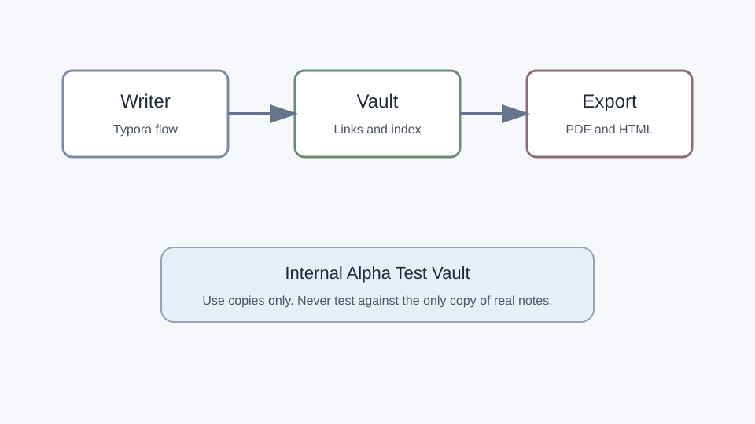

***

aliases: \[Writing Flow, Serein Flow]
tags: \[writing, serein, test]
priority: 1
-----------

# Serein Writing Flow

This note is for testing the writing experience first. It should feel quiet, direct, and stable.

## Paragraph Editing

Edit this paragraph in Rich Edit. Add text in the middle, then save, close the app, reopen it, and confirm the text is still there.

Use Chinese and English in the same paragraph: Serein 是一个本地 Markdown 写作工具，the editor must keep spacing readable.

## Markdown Basics

* Bullet item one

* Bullet item two

  * Nested bullet item

  * Another nested item

1. Ordered item one
2. Ordered item two
3. Ordered item three

> A quote block should be easy to exit by pressing Enter on an empty quote line.

## Task List

* [x] Create a note.

* [ ] Edit a table.

* [ ] Export to PDF.

* [ ] Rename a linked note.

## Table

| Feature   | Expected                | Risk     |
| --------- | ----------------------- | -------- |
| Save      | No data loss            | Critical |
| Wiki link | Single click opens note | High     |
| PDF       | Images exported         | Medium   |
| Graph     | Does not freeze         | Medium   |

## Code Block

```bash
echo "Serein smoke test"
printf "中文路径 test\n"
```

## Inline Elements

This paragraph has **bold**, *italic*, `inline code`, [a Markdown link](../Projects/Roadmap.md), and a wiki link to [[Projects/Serein Launch]].

## Image



## Footnote

This sentence has a footnote.[^release]

[^release]: Internal test data, not real user documentation.

<br />

1212
