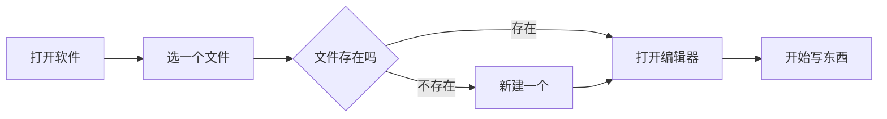
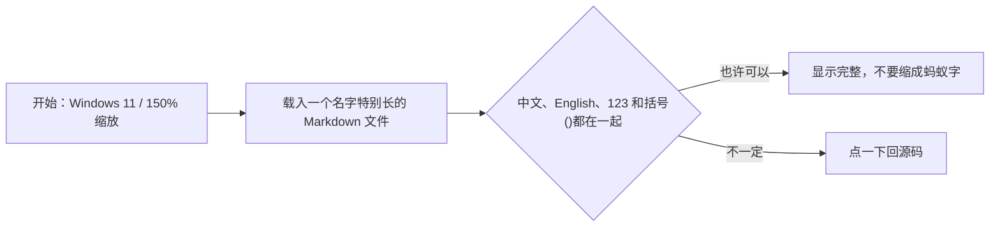
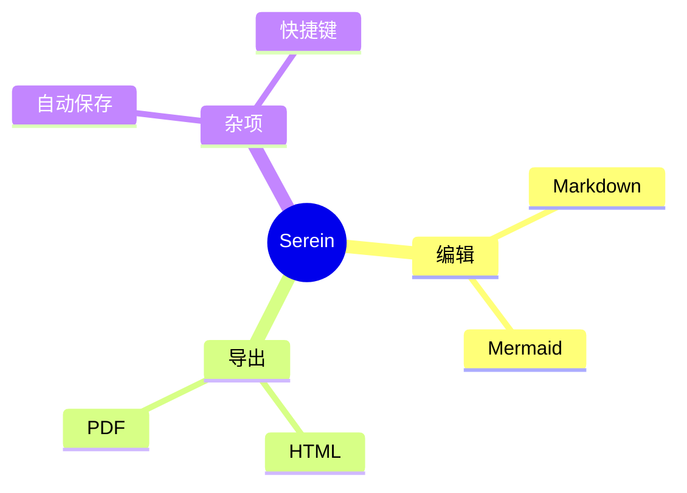

# Mermaid 随手测试

这不是规范教程。图有写对的，也有随手写错的，主要看 Serein 会不会正常渲染或退回源码。

普通链接：[Mermaid](https://mermaid.js.org/)；普通代码：`flowchart LR`。

## 登录流程，大概是这样



节点名没统一用 A、B、C，中文也没有全部加引号。

## 名字有点长



## 时序，临时写的

```MERMAID
sequenceDiagram
  participant 我
  participant app as Serein
  participant disk as 本地磁盘
  我->>app: 输入 Mermaid
  app->>disk: 自动保存？
  disk-->>app: 先别急
  app-->>我: 图画出来了
```

## 一个 mindmap



## 这个忘记写图类型了

```mermaid
Serein
  编辑器
    Mermaid
    Markdown
  导出
    HTML
    PDF
```

普通表格也留一个：

| 图 | 随手备注 |
| --- | --- |
| 流程图 | 中文没全加引号 |
| mindmap | 有一个故意写错 |

## 最后这个没写完

```mermaid
flowchart LR
  X[还没写完] --> Y{

后面的 fence 也忘记关了。
